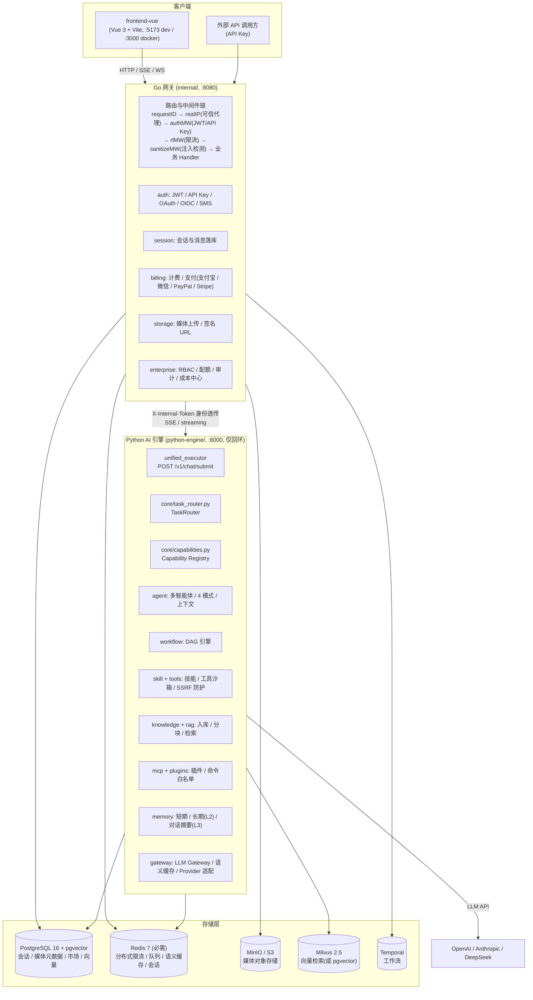
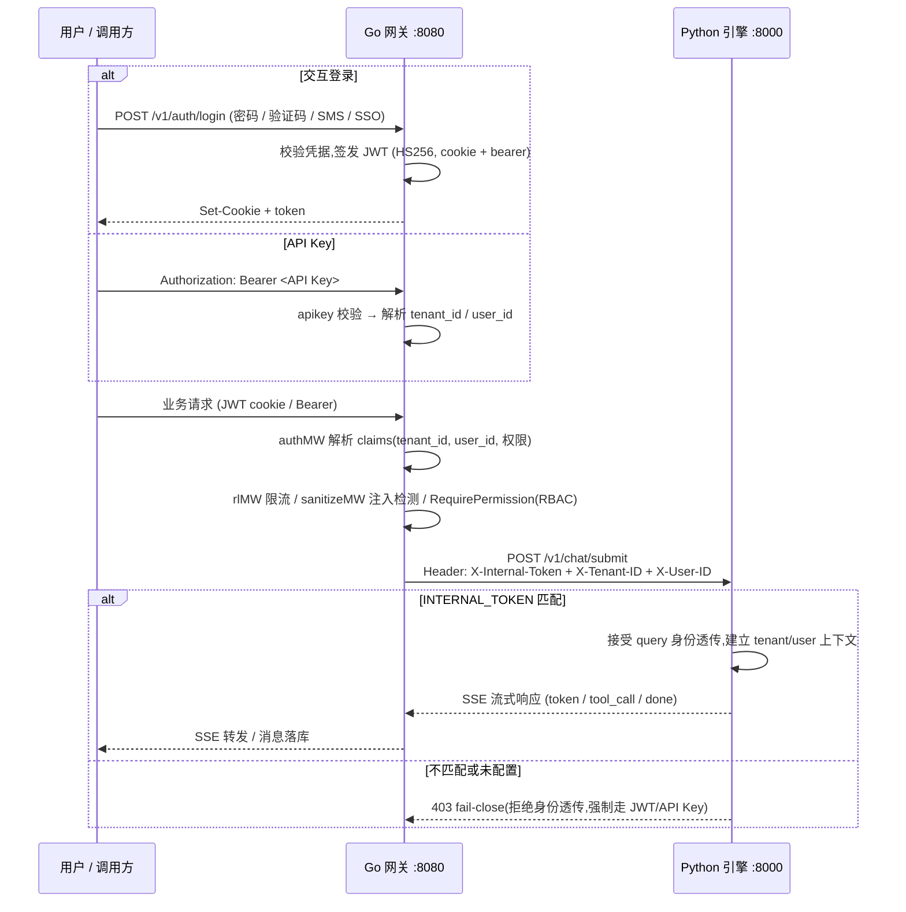
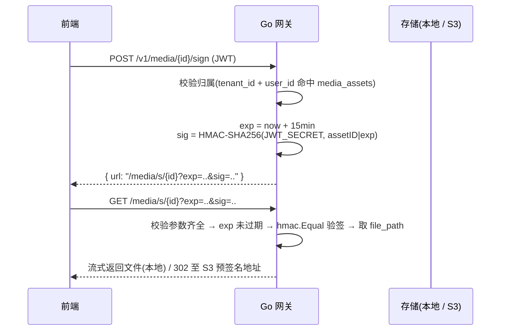

# MiniCC 架构文档

> 本文基于仓库真实代码编写。模块路径:`github.com/athenavi/minicc`(Go 网关)、`python-engine/`(Python AI 引擎)、`frontend-vue/`(Vue 3 前端)。

## 1. 总体架构



**分层职责**:

- **前端**(`frontend-vue/`):六大工作台入口、聊天界面(虚拟滚动 / 流式思维链 / 工具链还原)、工作流 DAG 画布(@vue-flow)、管理后台。只与网关通信。
- **Go 网关**(`internal/`):唯一对外入口。负责认证(HTTP cookie JWT / Bearer / API Key)、限流(每用户 RPM / 每租户 RPS / 全局)、CORS/CSP、请求注入检测、计费扣减、SSE 事件转发(`GET /events`)、WebSocket(`/ws/{sessionId}`、`/ws/rpa`)、媒体与市场等管理面 API;业务推理统一代理到 Python 引擎。
- **Python AI 引擎**(`python-engine/`,FastAPI):Agent 推理循环、TaskRouter 统一编排、工具沙箱、RAG、记忆、LLM Gateway。默认仅绑定 `127.0.0.1:8000`,生产经反向代理/网关访问。
- **存储层**:PostgreSQL(pgvector)为主库与向量库,Redis 为必需中间件,MinIO/S3 存媒体对象,Milvus 存独立向量集,Temporal 托管工作流。

## 2. 认证与身份透传链路



要点:

1. 网关是唯一身份来源;Python 引擎**不直接对公网**。
2. `INTERNAL_TOKEN` 为网关 → 引擎共享密钥(`X-Internal-Token`)。未配置时 Python 对网关的 query 身份透传采取 **fail-close** 拒绝,避免绕过网关直接伪造租户身份(见 `python-engine/app/config.py` 与 `internal/config` 注释)。
3. 会话与消息由网关写入 PostgreSQL(`messages` / `tool_calls`),刷新后不丢历史。

## 3. 统一入口与 TaskRouter

对话、Agent、工作流、技能、知识库、插件六大工作台不是孤岛:引擎以 `POST /v1/chat/submit` 为统一入口(`python-engine/app/api/unified_executor.py`),经 TaskRouter 自动编排;网关侧 `POST /submit`(SSE 代理)与 `POST /v1/agents/dispatch` 均汇聚到此链路。


- `core/capabilities.py`:能力注册表,`WorkstationType` 枚举对话 `dialogue` / Agent `agent` / 工作流 `workflow` / 技能 `skill` / 知识库 `knowledge` / 插件 `plugin` 六类工作台,外加工具型 / 服务型 / 模板型 / 组合型能力。
- `core/task_router.py`:将任务拆解为带依赖的子任务,按能力匹配执行路径,支持并行调度与统一异常恢复。
- 工作流引擎(`app/workflow/`)支持 DAG 运行时编辑;Agent 协同(`app/agent/collaboration.py`)支持多智能体并发与上下文共享。

## 4. 六大工作台互联互通

| 工作台 | 核心能力 | 互联方式 |
|---|---|---|
| 对话 `dialogue` | 4 模式(常规 / 极简 / PTC / 创造)、流式输出、工具三态裁决 | 入口本身即 TaskRouter 统一编排(`quick_execute`) |
| Agent `agent` | 多智能体协同、任务分发 `/v1/agents/dispatch`、结果追踪 | Agent 任务可调起工作流 / 技能 / 知识库检索 |
| 工作流 `workflow` | DAG 编排、节点自由连线、运行时编辑 | 节点可执行技能与知识库查询(`dynamic_nodes.py` 调 `/v1/chat/submit`) |
| 技能 `skill` | 技能市场安装 / 卸载、技能执行沙箱 | 技能即工具,供对话 / Agent / 工作流节点调用 |
| 知识库 `knowledge` | 文档入库、向量化、RAG 检索 | 供各工作台检索上下文(`kb_search` 服务型能力) |
| 插件 `plugin` | MCP 服务配置、每用户插件目录 `data/plugins/{user}/plugins.json` | MCP 工具注册为能力,受 `PLUGIN_COMMAND_ALLOWLIST` 约束 |

跨工作台隔离与协同由 `tests/test_cross_workstation_interop.py`、`test_e2e_cross_workstation_isolation.py` 等测试覆盖。

## 5. 多租户与用户级隔离矩阵

| 层 | 隔离机制 |
|---|---|
| PostgreSQL | 所有业务表查询强制 `tenant_id`(+ `user_id` 私有资源)条件;迁移 `migrations/20260822000001_tenant_isolation.up.sql` 落地约束与索引 |
| Redis | key 按租户 / 用户命名空间隔离;Redis Stream trace 按租户分 key;分布式限流按租户独立计数 |
| Milvus / pgvector | 向量检索携带 `tenant_id` filter,集合内按租户过滤 |
| 媒体 | `media_assets` 归属校验:`SELECT ... WHERE id=$1 AND tenant_id=$2 AND user_id=$3` 通过后才签发签名 URL |
| 插件 | 每用户插件配置独立目录,市场安装记录 `ent_catalog_installs` 按租户(`tenant_id`)启停 |
| 沙箱 | 每用户沙箱工作区 `sandbox/{tenant}/{user}/workspace`,文件系统权限隔离 |
| 企业管控 | 配额 / 成本中心 / 审计 / 模型策略均按租户维度;RBAC 角色 / 群组在租户内生效 |

## 6. 媒体签名 URL 流程

媒体资源不公开可猜测路径,统一走"归属校验 + HMAC 签名 + 短期有效"链路(见 `internal/api/media_sign.go`):



- 上传侧:`POST /v1/media/upload`(直传)、`POST /v1/media/presign`(S3 预签名)+ `POST /v1/media/complete`(分片合并),规避存储型 XSS 与超限文件。
- 签名密钥为 `JWT_SECRET`(认证器 `SigningSecret()`),与 JWT 同源,泄露任一方均视为凭证泄露。

## 7. Redis 必需化决策

Redis 从"可选缓存"升级为**核心依赖**(提交 `6df638d feat(redis): Redis 必需化(fail-fast,无降级模式)`),理由:

1. **分布式限流**:`internal/api/distributed_ratelimit.go` + `tenant_rate_limiter.go` 以 Redis 原子操作为准,保证多副本一致;
2. **任务队列**:引擎 `queue` 模块与 `queue_worker_concurrency` 消费者依赖 Redis 队列;
3. **语义缓存**:LLM Gateway L1/L2 缓存与语义去重(`semantic_cache_threshold`)落地 Redis;
4. **会话与上下文**:Context Store、短期记忆、SSE 事件缓冲均使用 Redis;
5. **可观测**:Redis Stream 承载 trace 事件,按租户分 key。

**决策含义**:Redis 不可用时服务**快速失败**而非静默降级——避免"限流失效 / 缓存过期但接口看似正常"的隐蔽风险;`RATE_LIMIT_FAIL_CLOSE` 等开关进一步保证写入路径在 Redis 异常时拒绝而非放行。部署上必须保证 Redis 高可用(哨兵 / 集群,`REDIS_MODE` 支持 `single|cluster|sentinel`)。

## 8. 安全设计要点

- 输入净化中间件(`internal/api/security.go`):Prompt 注入正则检测 + `<user_input>` 包裹;
- 工具沙箱:`python-engine/app/tools/ssrf.py` 端口白名单 + `PLUGIN_COMMAND_ALLOWLIST` 命令白名单(空 = 全禁);
- 身份透传 fail-close(见 §2);可信代理 CIDR 防 XFF 伪造;`/metrics` Bearer token 鉴权;
- 详细说明见 [SECURITY.md](../SECURITY.md)。

## 9. 代码目录映射

```
cmd/                  Go 入口:minicc 网关 / migrate / minicc-cli / stress
internal/
  ├── api/            路由注册(gateway_router.go)、Handler、中间件、媒体 / 市场 / 企业 API
  ├── auth/           JWT、API Key、OAuth/OIDC、SMS、验证码
  ├── billing/        计费与支付(支付宝 / 微信 / PayPal / Stripe)
  ├── broadcast/      SSE 事件总线
  ├── db/             pgx 连接池、Redis 客户端、审计落库、atlas 迁移辅助
  ├── engine/         PythonClient(网关 → 引擎 HTTP 代理)
  ├── enterprise/     企业能力(标识 / 策略 / 配额)
  ├── monitor/        Prometheus 指标与 trace
  ├── session/        会话与消息落库
  └── storage/        本地 / S3 媒体存储抽象
python-engine/app/
  ├── agent/          Agent 运行时、协同、模式(4 模式)、任务消费
  ├── core/           capabilities 注册表、task_router 统一编排
  ├── workflow/       DAG 工作流引擎
  ├── skill/ tools/   技能与工具执行、沙箱、SSRF 防护
  ├── knowledge/ rag/ 知识库与检索
  ├── mcp/ plugins/   MCP 插件与命令白名单
  ├── memory/         记忆(L1/L2/L3)
  ├── gateway/ llm/ providers/  LLM Gateway、语义缓存、Provider 适配
  └── api/            FastAPI 路由(unified_executor.py 等)
frontend-vue/src/
  ├── views/          六大工作台 + 管理后台
  ├── components/     chat / home / common 组件
  ├── router/         路由与守卫(guard.ts)
  └── stores/ api/    Pinia 状态与网关 API 封装
```
