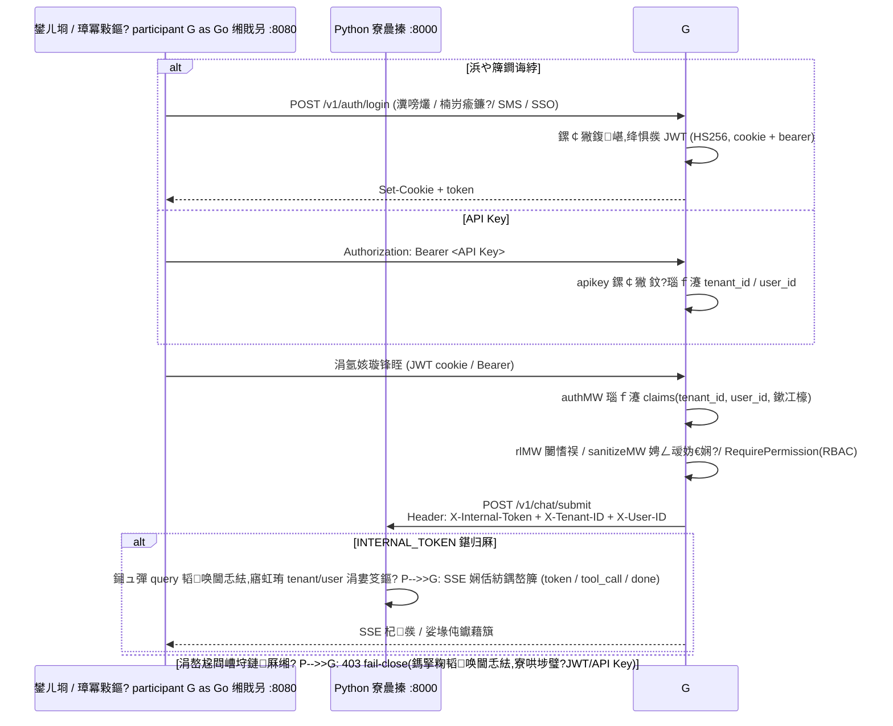
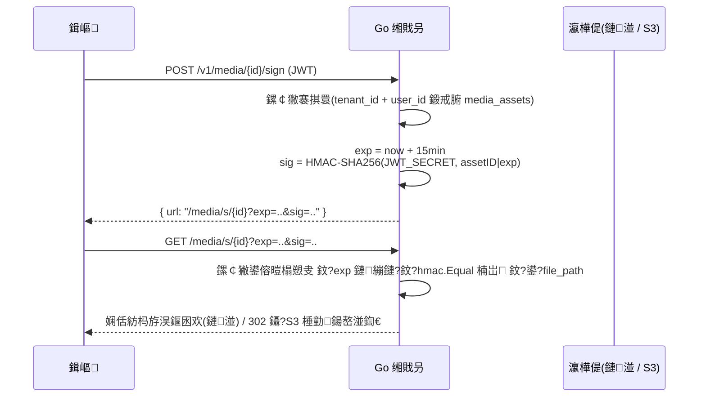

# chiron 鏋舵瀯鏂囨。

> 鏈枃鍩轰簬浠撳簱鐪熷疄浠ｇ爜缂栧啓銆傛ā鍧楄矾寰?`github.com/athenavi/chiron`(Go 缃戝叧)銆乣python-engine/`(Python AI 寮曟搸)銆乣frontend-vue/`(Vue 3 鍓嶇)銆?
## 1. 鎬讳綋鏋舵瀯

```mermaid
flowchart TB
    subgraph Client["瀹㈡埛绔?]
        FE["frontend-vue<br/>(Vue 3 + Vite, :5173 dev / :3000 docker)"]
        API["澶栭儴 API 璋冪敤鏂?br/>(API Key)"]
    end

    subgraph GW["Go 缃戝叧 (internal/, :8080)"]
        RT["璺敱涓庝腑闂翠欢閾?br/>requestID 鈫?realIP(鍙俊浠ｇ悊) 鈫?authMW(JWT/API Key)<br/>鈫?rlMW(闄愭祦) 鈫?sanitizeMW(娉ㄥ叆妫€娴? 鈫?涓氬姟 Handler"]
        AUTH["auth: JWT / API Key / OAuth / OIDC / SMS"]
        SESS["session: 浼氳瘽涓庢秷鎭惤搴?]
        BILL["billing: 璁¤垂 / 鏀粯(鏀粯瀹?/ 寰俊 / PayPal / Stripe)"]
        MEDIA["storage: 濯掍綋涓婁紶 / 绛惧悕 URL"]
        ENT["enterprise: RBAC / 閰嶉 / 瀹¤ / 鎴愭湰涓績"]
    end

    subgraph PY["Python AI 寮曟搸 (python-engine/, :8000, 浠呭洖鐜?"]
        UEXEC["unified_executor<br/>POST /v1/chat/submit"]
        TR["core/task_router.py<br/>TaskRouter"]
        CAP["core/capabilities.py<br/>Capability Registry"]
        AGENT["agent: 澶氭櫤鑳戒綋 / 4 妯″紡 / 涓婁笅鏂?]
        WF["workflow: DAG 寮曟搸"]
        SKILL["skill + tools: 鎶€鑳?/ 宸ュ叿娌欑 / SSRF 闃叉姢"]
        KB["knowledge + rag: 鍏ュ簱 / 鍒嗗潡 / 妫€绱?]
        MCP["mcp + plugins: 鎻掍欢 / 鍛戒护鐧藉悕鍗?]
        MEM["memory: 鐭湡 / 闀挎湡(L2) / 瀵硅瘽鎽樿(L3)"]
        GATE["gateway: LLM Gateway / 璇箟缂撳瓨 / Provider 閫傞厤"]
    end

    subgraph Store["瀛樺偍灞?]
        PG[("PostgreSQL 16 + pgvector<br/>浼氳瘽 / 濯掍綋鍏冩暟鎹?/ 甯傚満 / 鍚戦噺")]
        RDS[("Redis 7 (蹇呴渶)<br/>鍒嗗竷寮忛檺娴?/ 闃熷垪 / 璇箟缂撳瓨 / 浼氳瘽")]
        S3[("MinIO / S3<br/>濯掍綋瀵硅薄瀛樺偍")]
        MILVUS[("Milvus 2.5<br/>鍚戦噺妫€绱?鎴?pgvector)")]
        TMP[("Temporal<br/>宸ヤ綔娴?)]
    end

    FE -->|"HTTP / SSE / WS"| GW
    API --> GW
    GW -->|"X-Internal-Token 韬唤閫忎紶<br/>SSE / streaming"| PY
    PY -->|"LLM API"| LLM["OpenAI / Anthropic / DeepSeek"]
    GW --> PG
    GW --> RDS
    GW --> S3
    GW --> TMP
    PY --> RDS
    PY --> PG
    PY --> MILVUS
```

**鍒嗗眰鑱岃矗**:

- **鍓嶇**(`frontend-vue/`):鍏ぇ宸ヤ綔鍙板叆鍙ｃ€佽亰澶╃晫闈?铏氭嫙婊氬姩 / 娴佸紡鎬濈淮閾?/ 宸ュ叿閾捐繕鍘?銆佸伐浣滄祦 DAG 鐢诲竷(@vue-flow)銆佺鐞嗗悗鍙般€傚彧涓庣綉鍏抽€氫俊銆?- **Go 缃戝叧**(`internal/`):鍞竴瀵瑰鍏ュ彛銆傝礋璐ｈ璇?HTTP cookie JWT / Bearer / API Key)銆侀檺娴?姣忕敤鎴?RPM / 姣忕鎴?RPS / 鍏ㄥ眬)銆丆ORS/CSP銆佽姹傛敞鍏ユ娴嬨€佽璐规墸鍑忋€丼SE 浜嬩欢杞彂(`GET /events`)銆乄ebSocket(`/ws/{sessionId}`銆乣/ws/rpa`)銆佸獟浣撲笌甯傚満绛夌鐞嗛潰 API;涓氬姟鎺ㄧ悊缁熶竴浠ｇ悊鍒?Python 寮曟搸銆?- **Python AI 寮曟搸**(`python-engine/`,FastAPI):Agent 鎺ㄧ悊寰幆銆乀askRouter 缁熶竴缂栨帓銆佸伐鍏锋矙绠便€丷AG銆佽蹇嗐€丩LM Gateway銆傞粯璁や粎缁戝畾 `127.0.0.1:8000`,鐢熶骇缁忓弽鍚戜唬鐞?缃戝叧璁块棶銆?- **瀛樺偍灞?*:PostgreSQL(pgvector)涓轰富搴撲笌鍚戦噺搴?Redis 涓哄繀闇€涓棿浠?MinIO/S3 瀛樺獟浣撳璞?Milvus 瀛樼嫭绔嬪悜閲忛泦,Temporal 鎵樼宸ヤ綔娴併€?
## 2. 璁よ瘉涓庤韩浠介€忎紶閾捐矾



瑕佺偣:

1. 缃戝叧鏄敮涓€韬唤鏉ユ簮;Python 寮曟搸**涓嶇洿鎺ュ鍏綉**銆?2. `INTERNAL_TOKEN` 涓虹綉鍏?鈫?寮曟搸鍏变韩瀵嗛挜(`X-Internal-Token`)銆傛湭閰嶇疆鏃?Python 瀵圭綉鍏崇殑 query 韬唤閫忎紶閲囧彇 **fail-close** 鎷掔粷,閬垮厤缁曡繃缃戝叧鐩存帴浼€犵鎴疯韩浠?瑙?`python-engine/app/config.py` 涓?`internal/config` 娉ㄩ噴)銆?3. 浼氳瘽涓庢秷鎭敱缃戝叧鍐欏叆 PostgreSQL(`messages` / `tool_calls`),鍒锋柊鍚庝笉涓㈠巻鍙层€?
## 3. 缁熶竴鍏ュ彛涓?TaskRouter

瀵硅瘽銆丄gent銆佸伐浣滄祦銆佹妧鑳姐€佺煡璇嗗簱銆佹彃浠跺叚澶у伐浣滃彴涓嶆槸瀛ゅ矝:寮曟搸浠?`POST /v1/chat/submit` 涓虹粺涓€鍏ュ彛(`python-engine/app/api/unified_executor.py`),缁?TaskRouter 鑷姩缂栨帓;缃戝叧渚?`POST /submit`(SSE 浠ｇ悊)涓?`POST /v1/agents/dispatch` 鍧囨眹鑱氬埌姝ら摼璺€?


- `core/capabilities.py`:鑳藉姏娉ㄥ唽琛?`WorkstationType` 鏋氫妇瀵硅瘽 `dialogue` / Agent `agent` / 宸ヤ綔娴?`workflow` / 鎶€鑳?`skill` / 鐭ヨ瘑搴?`knowledge` / 鎻掍欢 `plugin` 鍏被宸ヤ綔鍙?澶栧姞宸ュ叿鍨?/ 鏈嶅姟鍨?/ 妯℃澘鍨?/ 缁勫悎鍨嬭兘鍔涖€?- `core/task_router.py`:灏嗕换鍔℃媶瑙ｄ负甯︿緷璧栫殑瀛愪换鍔?鎸夎兘鍔涘尮閰嶆墽琛岃矾寰?鏀寔骞惰璋冨害涓庣粺涓€寮傚父鎭㈠銆?- 宸ヤ綔娴佸紩鎿?`app/workflow/`)鏀寔 DAG 杩愯鏃剁紪杈?Agent 鍗忓悓(`app/agent/collaboration.py`)鏀寔澶氭櫤鑳戒綋骞跺彂涓庝笂涓嬫枃鍏变韩銆?
## 4. 鍏ぇ宸ヤ綔鍙颁簰鑱斾簰閫?
| 宸ヤ綔鍙?| 鏍稿績鑳藉姏 | 浜掕仈鏂瑰紡 |
|---|---|---|
| 瀵硅瘽 `dialogue` | 4 妯″紡(甯歌 / 鏋佺畝 / PTC / 鍒涢€?銆佹祦寮忚緭鍑恒€佸伐鍏蜂笁鎬佽鍐?| 鍏ュ彛鏈韩鍗?TaskRouter 缁熶竴缂栨帓(`quick_execute`) |
| Agent `agent` | 澶氭櫤鑳戒綋鍗忓悓銆佷换鍔″垎鍙?`/v1/agents/dispatch`銆佺粨鏋滆拷韪?| Agent 浠诲姟鍙皟璧峰伐浣滄祦 / 鎶€鑳?/ 鐭ヨ瘑搴撴绱?|
| 宸ヤ綔娴?`workflow` | DAG 缂栨帓銆佽妭鐐硅嚜鐢辫繛绾裤€佽繍琛屾椂缂栬緫 | 鑺傜偣鍙墽琛屾妧鑳戒笌鐭ヨ瘑搴撴煡璇?`dynamic_nodes.py` 璋?`/v1/chat/submit`) |
| 鎶€鑳?`skill` | 鎶€鑳藉競鍦哄畨瑁?/ 鍗歌浇銆佹妧鑳芥墽琛屾矙绠?| 鎶€鑳藉嵆宸ュ叿,渚涘璇?/ Agent / 宸ヤ綔娴佽妭鐐硅皟鐢?|
| 鐭ヨ瘑搴?`knowledge` | 鏂囨。鍏ュ簱銆佸悜閲忓寲銆丷AG 妫€绱?| 渚涘悇宸ヤ綔鍙版绱笂涓嬫枃(`kb_search` 鏈嶅姟鍨嬭兘鍔? |
| 鎻掍欢 `plugin` | MCP 鏈嶅姟閰嶇疆銆佹瘡鐢ㄦ埛鎻掍欢鐩綍 `data/plugins/{user}/plugins.json` | MCP 宸ュ叿娉ㄥ唽涓鸿兘鍔?鍙?`PLUGIN_COMMAND_ALLOWLIST` 绾︽潫 |

璺ㄥ伐浣滃彴闅旂涓庡崗鍚岀敱 `tests/test_cross_workstation_interop.py`銆乣test_e2e_cross_workstation_isolation.py` 绛夋祴璇曡鐩栥€?
## 5. 澶氱鎴蜂笌鐢ㄦ埛绾ч殧绂荤煩闃?
| 灞?| 闅旂鏈哄埗 |
|---|---|
| PostgreSQL | 鎵€鏈変笟鍔¤〃鏌ヨ寮哄埗 `tenant_id`(+ `user_id` 绉佹湁璧勬簮)鏉′欢;杩佺Щ `migrations/20260822000001_tenant_isolation.up.sql` 钀藉湴绾︽潫涓庣储寮?|
| Redis | key 鎸夌鎴?/ 鐢ㄦ埛鍛藉悕绌洪棿闅旂;Redis Stream trace 鎸夌鎴峰垎 key;鍒嗗竷寮忛檺娴佹寜绉熸埛鐙珛璁℃暟 |
| Milvus / pgvector | 鍚戦噺妫€绱㈡惡甯?`tenant_id` filter,闆嗗悎鍐呮寜绉熸埛杩囨护 |
| 濯掍綋 | `media_assets` 褰掑睘鏍￠獙:`SELECT ... WHERE id=$1 AND tenant_id=$2 AND user_id=$3` 閫氳繃鍚庢墠绛惧彂绛惧悕 URL |
| 鎻掍欢 | 姣忕敤鎴锋彃浠堕厤缃嫭绔嬬洰褰?甯傚満瀹夎璁板綍 `ent_catalog_installs` 鎸夌鎴?`tenant_id`)鍚仠 |
| 娌欑 | 姣忕敤鎴锋矙绠卞伐浣滃尯 `sandbox/{tenant}/{user}/workspace`,鏂囦欢绯荤粺鏉冮檺闅旂 |
| 浼佷笟绠℃帶 | 閰嶉 / 鎴愭湰涓績 / 瀹¤ / 妯″瀷绛栫暐鍧囨寜绉熸埛缁村害;RBAC 瑙掕壊 / 缇ょ粍鍦ㄧ鎴峰唴鐢熸晥 |

## 6. 濯掍綋绛惧悕 URL 娴佺▼

濯掍綋璧勬簮涓嶅叕寮€鍙寽娴嬭矾寰?缁熶竴璧?褰掑睘鏍￠獙 + HMAC 绛惧悕 + 鐭湡鏈夋晥"閾捐矾(瑙?`internal/api/media_sign.go`):



- 涓婁紶渚?`POST /v1/media/upload`(鐩翠紶)銆乣POST /v1/media/presign`(S3 棰勭鍚?+ `POST /v1/media/complete`(鍒嗙墖鍚堝苟),瑙勯伩瀛樺偍鍨?XSS 涓庤秴闄愭枃浠躲€?- 绛惧悕瀵嗛挜涓?`JWT_SECRET`(璁よ瘉鍣?`SigningSecret()`),涓?JWT 鍚屾簮,娉勯湶浠讳竴鏂瑰潎瑙嗕负鍑瘉娉勯湶銆?
## 7. Redis 蹇呴渶鍖栧喅绛?
Redis 浠?鍙€夌紦瀛?鍗囩骇涓?*鏍稿績渚濊禆**(鎻愪氦 `6df638d feat(redis): Redis 蹇呴渶鍖?fail-fast,鏃犻檷绾фā寮?`),鐞嗙敱:

1. **鍒嗗竷寮忛檺娴?*:`internal/api/distributed_ratelimit.go` + `tenant_rate_limiter.go` 浠?Redis 鍘熷瓙鎿嶄綔涓哄噯,淇濊瘉澶氬壇鏈竴鑷?
2. **浠诲姟闃熷垪**:寮曟搸 `queue` 妯″潡涓?`queue_worker_concurrency` 娑堣垂鑰呬緷璧?Redis 闃熷垪;
3. **璇箟缂撳瓨**:LLM Gateway L1/L2 缂撳瓨涓庤涔夊幓閲?`semantic_cache_threshold`)钀藉湴 Redis;
4. **浼氳瘽涓庝笂涓嬫枃**:Context Store銆佺煭鏈熻蹇嗐€丼SE 浜嬩欢缂撳啿鍧囦娇鐢?Redis;
5. **鍙娴?*:Redis Stream 鎵胯浇 trace 浜嬩欢,鎸夌鎴峰垎 key銆?
**鍐崇瓥鍚箟**:Redis 涓嶅彲鐢ㄦ椂鏈嶅姟**蹇€熷け璐?*鑰岄潪闈欓粯闄嶇骇鈥斺€旈伩鍏?闄愭祦澶辨晥 / 缂撳瓨杩囨湡浣嗘帴鍙ｇ湅浼兼甯?鐨勯殣钄介闄?`RATE_LIMIT_FAIL_CLOSE` 绛夊紑鍏宠繘涓€姝ヤ繚璇佸啓鍏ヨ矾寰勫湪 Redis 寮傚父鏃舵嫆缁濊€岄潪鏀捐銆傞儴缃蹭笂蹇呴』淇濊瘉 Redis 楂樺彲鐢?鍝ㄥ叺 / 闆嗙兢,`REDIS_MODE` 鏀寔 `single|cluster|sentinel`)銆?
## 8. 瀹夊叏璁捐瑕佺偣

- 杈撳叆鍑€鍖栦腑闂翠欢(`internal/api/security.go`):Prompt 娉ㄥ叆姝ｅ垯妫€娴?+ `<user_input>` 鍖呰９;
- 宸ュ叿娌欑:`python-engine/app/tools/ssrf.py` 绔彛鐧藉悕鍗?+ `PLUGIN_COMMAND_ALLOWLIST` 鍛戒护鐧藉悕鍗?绌?= 鍏ㄧ);
- 韬唤閫忎紶 fail-close(瑙?搂2);鍙俊浠ｇ悊 CIDR 闃?XFF 浼€?`/metrics` Bearer token 閴存潈;
- 璇︾粏璇存槑瑙?[SECURITY.md](../SECURITY.md)銆?
## 9. 浠ｇ爜鐩綍鏄犲皠

```
cmd/                  Go 鍏ュ彛:chiron 缃戝叧 / migrate / chiron-cli / stress
internal/
  鈹溾攢鈹€ api/            璺敱娉ㄥ唽(gateway_router.go)銆丠andler銆佷腑闂翠欢銆佸獟浣?/ 甯傚満 / 浼佷笟 API
  鈹溾攢鈹€ auth/           JWT銆丄PI Key銆丱Auth/OIDC銆丼MS銆侀獙璇佺爜
  鈹溾攢鈹€ billing/        璁¤垂涓庢敮浠?鏀粯瀹?/ 寰俊 / PayPal / Stripe)
  鈹溾攢鈹€ broadcast/      SSE 浜嬩欢鎬荤嚎
  鈹溾攢鈹€ db/             pgx 杩炴帴姹犮€丷edis 瀹㈡埛绔€佸璁¤惤搴撱€乤tlas 杩佺Щ杈呭姪
  鈹溾攢鈹€ engine/         PythonClient(缃戝叧 鈫?寮曟搸 HTTP 浠ｇ悊)
  鈹溾攢鈹€ enterprise/     浼佷笟鑳藉姏(鏍囪瘑 / 绛栫暐 / 閰嶉)
  鈹溾攢鈹€ monitor/        Prometheus 鎸囨爣涓?trace
  鈹溾攢鈹€ session/        浼氳瘽涓庢秷鎭惤搴?  鈹斺攢鈹€ storage/        鏈湴 / S3 濯掍綋瀛樺偍鎶借薄
python-engine/app/
  鈹溾攢鈹€ agent/          Agent 杩愯鏃躲€佸崗鍚屻€佹ā寮?4 妯″紡)銆佷换鍔℃秷璐?  鈹溾攢鈹€ core/           capabilities 娉ㄥ唽琛ㄣ€乼ask_router 缁熶竴缂栨帓
  鈹溾攢鈹€ workflow/       DAG 宸ヤ綔娴佸紩鎿?  鈹溾攢鈹€ skill/ tools/   鎶€鑳戒笌宸ュ叿鎵ц銆佹矙绠便€丼SRF 闃叉姢
  鈹溾攢鈹€ knowledge/ rag/ 鐭ヨ瘑搴撲笌妫€绱?  鈹溾攢鈹€ mcp/ plugins/   MCP 鎻掍欢涓庡懡浠ょ櫧鍚嶅崟
  鈹溾攢鈹€ memory/         璁板繂(L1/L2/L3)
  鈹溾攢鈹€ gateway/ llm/ providers/  LLM Gateway銆佽涔夌紦瀛樸€丳rovider 閫傞厤
  鈹斺攢鈹€ api/            FastAPI 璺敱(unified_executor.py 绛?
frontend-vue/src/
  鈹溾攢鈹€ views/          鍏ぇ宸ヤ綔鍙?+ 绠＄悊鍚庡彴
  鈹溾攢鈹€ components/     chat / home / common 缁勪欢
  鈹溾攢鈹€ router/         璺敱涓庡畧鍗?guard.ts)
  鈹斺攢鈹€ stores/ api/    Pinia 鐘舵€佷笌缃戝叧 API 灏佽
```

